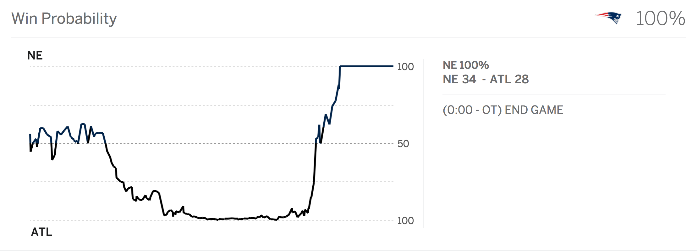

## Hans Rosling

### [Gapminder](https://www.gapminder.org/about-gapminder/)

> Gapminder is an independent Swedish foundation with no political, religious or economic affiliations. Gapminder is a fact tank, not a think tank. Gapminder fights devastating misconceptions about global development. Gapminder produces free teaching resources making the world understandable based on reliable statistics. Gapminder promotes a fact-based worldview everyone can understand.

- [Ted Talk](https://www.ted.com/talks/hans_rosling_shows_the_best_stats_you_ve_ever_seen)

## Who am I?

### School

- NYU Microbiology '12
- UMD Computer Science '15

### Work

- NYU Genomics 2012
- UMD UMIACS (Microbiome) 2013 - 2015
- JHU Biostatistics 2015 -

## How did I come to this topic?


http://swirlstats.com/

## Swirl

- Why does Swirl work?
- Why isn't there Swirl for Python yet?

## Humans Struggle to Understand Systems


## Humans Struggle to Understand Systems

<blockquote class="twitter-tweet" data-conversation="none" data-lang="en"><p lang="en" dir="ltr"><a href="https://twitter.com/eliyudin">@eliyudin</a> *coin flip comes up heads twice in a row* wow, literally the election</p>&mdash; Eli Yudin (@eliyudin) <a href="https://twitter.com/eliyudin/status/828460712481677312">February 6, 2017</a></blockquote>
<script async src="https://platform.twitter.com/widgets.js" charset="utf-8"></script>

## Humans Struggle to Understand Systems



## We Can't Teach Everyone Statistics

We actually tried teaching everyone statistics and it didn't work.

## Nick Strayer

http://nickstrayer.me/distributionTransforms/

## Nicky Case & Vi Hart

- [Parable of the Polygons](http://ncase.me/polygons/)
- [To Build a Better Ballot](http://ncase.me/ballot/)

## Bret Victor

- [Tangle](http://worrydream.com/Tangle/)
- [The Humane Representation of Thought](https://vimeo.com/115154289)

## Principles for Data Interaction

### Wildly Rough and Unrefined Draft

- Data interaction is made possible by actions that the user takes, and 
reactions that the user experiences.
- There are generally three "modes" of interaction:
    - Individual
    - Group
    - Environment

## Example: Basic Interactive Plot

```{r, echo=FALSE, message=FALSE, warning=FALSE}
library(plotly)
plot_ly(mtcars, x = ~hp, y = ~mpg, color = ~factor(cyl), text = rownames(mtcars))
```

## Example: Scrubbing Music

<iframe width="100%" height="166" scrolling="no" frameborder="no" src="https://w.soundcloud.com/player/?url=https%3A//api.soundcloud.com/tracks/178667247&amp;color=ff5500&amp;auto_play=false&amp;hide_related=false&amp;show_comments=true&amp;show_user=true&amp;show_reposts=false"></iframe>

## First Foray: Visual Terminal

- [The Unix Workbench](http://seankross.com/the-unix-workbench/command-line-basics.html)
- [Terrible Broken Demo](http://seankross.com/visual-terminal/)

## I'm Teahcing a Class!!

- [Sign Up](http://jhudatascience.org/prototyping_students.html)

## Questions?

### Thank You!

